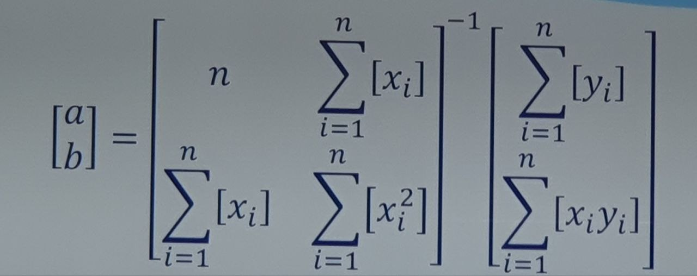

Regresiones lineales

Se basa en una variable dependiente y una independiente; una dependiente Y y una independiente X. Ejemplo

y = x + 1

En regresiones se tiene

y = x + C + e

Donde C es una constante y e el error

Modelo de regresion lineal simple

$$
y = \beta_0 + \beta_1 * x_1 + e_i
$$

---

|            | parametro    | estadigrafo |
| ---------- | ------------ | ----------- |
| Media      | $\mu$        | $\bar{x}$   |
| Varianza   | $\sigma^{2}$ | $S^{2}$     |
| Desviación | $\sigma$     | $S$         |
| Proporción | $p$          | $p$         |
| Tamaño     | $N$          | $n$         |

Modelo matematico

La idea es hallar los estimadores $\beta_0$, $\beta_1$, es decir; calcular la información de una muestra

Supuestos de la regresión

- Linealidad: Que tiene un comportamiento lineal

- Independencia: Significa que los errores son independendientes

- Homocedasticidad: Significa que la varianza es más o menos la misma en todos los samples (Conjuntos de datos)

- Colineadlidad: No existeng relaciones extra entre las variables independienetes

- Normalidad: Esta se refiere al error, dice que los errrores son más o menos prarecidos

$$
AX = B
$$

$$
A^{-1}AX = BA^{-1}
$$

$$
IX = BA^{-1}
$$

$$
X = BA^{-1}
$$

Método de reducicón por minimos cudrados

$$
\sum{[y_i - (a + b * x_i)]} = 0
$$

$$
\sum{y_i - \sum{a + b * x_i}} = a
$$

$$
\sum{y_i} = \sum{a + b * x_i}
$$

$$
\sum{y_i} = \sum{a} + b * \sum{x_i}
$$

$$
\sum{y_i} = na + b\sum{x_i}
$$

Derivadas de a y b

$$
\sum{[y_i - (a + b x_i)]}*x_i
$$

$$
\sum{y_ix_i} = \sum{a + bx_i} * x_i
$$

$$
\sum{x_i y_i} = a \sum{x_i} + b \sum{x_i^{2}}
$$

Determinante de la matriz de solución

$$
n\sum{x_i^{2}} - (\sum{x_i})^2 \neq 0
$$

